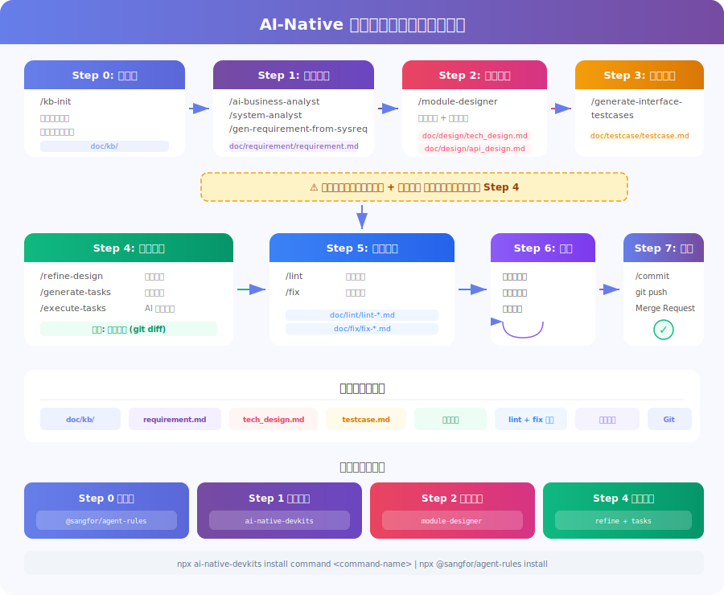

# AI Native 开发模式转型培训教材

> **面向未来的开发范式 —— 从"写代码"到"指挥AI写代码"**

---

## 目录

1. [为什么要转型 AI Native](#1-为什么要转型-ai-native)
2. [行业裁员警示：不转型的代价](#2-行业裁员警示不转型的代价)
3. [行业趋势与成熟案例](#3-行业趋势与成熟案例)
4. [AI Coding 工具全景图](#4-ai-coding-工具全景图)
5. [开发模式演进路线](#5-开发模式演进路线)
6. [核心工具实战指南](#6-核心工具实战指南)
7. [实战示范：五大场景 Before/After](#7-实战示范五大场景-beforeafter)
8. [AI Native 工作流最佳实践](#8-ai-native-工作流最佳实践)（含 8.3 SDD, 8.4 Agent 工程化）
9. [常见挑战与应对策略](#9-常见挑战与应对策略)
10. [团队落地路线图](#10-团队落地路线图)

---

## 1. 为什么要转型 AI Native


### 核心驱动力

**不转型的风险远大于转型的成本。** 当竞争对手的工程师以 2 倍效率交付产品时，坚持传统模式意味着被市场淘汰。

| 维度 | 传统模式 | AI Native 模式 |
|------|---------|----------------|
| **编码速度** | 手写每一行 | AI 生成 46-61% 代码 |
| **调试效率** | 人工排查 | AI 定位根因 + 修复建议 |
| **知识获取** | 查文档/搜索引擎 | 对话式即时获取 |
| **代码审查** | 纯人工 Review | AI 预审 + 人工决策 |
| **测试覆盖** | 经常不足 | AI 自动生成测试用例 |
| **上手新项目** | 数天到数周 | AI 辅助理解，数小时 |

---

## 2. 行业裁员警示：不转型的代价

> **AI 不会取代所有人，但会让不拥抱 AI 的人被取代。以下案例不是为了制造焦虑，而是让我们清醒认识到：掌握 AI 工具已经从"加分项"变成"生存技能"。**


### 2.1 Klarna 的教训：AI 替代不能盲目冒进

Klarna 是最激进的 AI 替代案例，也提供了最宝贵的反面教训：

```
时间线：
2023年   5,527 名员工
   ↓     CEO 大力推进 AI 替代战略
2024年   3,422 名员工 (↓38%)
   ↓     AI 聊天机器人替代 700 名客服
2025年   ~2,907 名员工 (↓47%)
   ↓     客户满意度大幅下滑 ❌
2025下半年 CEO 承认「走得太远了」，开始重新招人 🔄
```

> **关键启示：AI 可以替代部分工作，但不能替代所有判断。盲目裁员会反噬服务质量。**

### 2.2 Block 的"AI 原生"转型：40% 裁员震动行业

Block（原 Square）CEO Jack Dorsey 在 2026 年初宣布将公司转型为「AI 原生公司」：

- **裁员规模**：从 10,000+ 员工裁至不足 6,000 人（裁员 40%）
- **内部工具**：使用名为 "Goose" 的 AI 编码工具自动化开发流程
- **Dorsey 原话**：「智能工具，加上规模更小、层级更扁平的团队，催生了全新的工作方式」
- **被裁员工反馈**：部分前员工承认 AI 确实提升了效率，但认为「还无法取代数千名被裁员工的所有工作」

### 2.3 对初级开发者的冲击最大


### 2.4 这对我们意味着什么？

| 信号 | 解读 | 行动 |
|------|------|------|
| 大厂程序员大规模裁员 | AI 已经在替代重复性编码工作 | 尽快掌握 AI 工具，成为 **AI 增强型工程师** |
| 初级岗位萎缩 | 入门门槛提高，"会写代码"不再是竞争力 | 培养架构设计、需求分析、AI 协作能力 |
| Klarna 反面教训 | 盲目 AI 替代会反噬质量 | 找到 **人机协作的最佳平衡点** |
| "AI 原生公司"成趋势 | 不拥抱 AI 的企业将失去竞争力 | 部门级系统性转型，而非个人自发摸索 |

> **核心结论：掌握 AI Coding 不是为了"不被裁"，而是为了让自己的产出翻倍，成为不可替代的人。**

---

## 3. 行业趋势与成熟案例

### 3.1 标杆企业实践


### 3.2 关键启示

> **Shopify 模式**是团队转型的最佳参照：从领导层明确表态，到工具标准化，到绩效考核挂钩，形成了完整的闭环。

---

## 4. AI Coding 工具全景图


### 4.1 主力工具对比

| 工具 | 类型 | 核心能力 | 适用场景 | 定价参考 |
|------|------|---------|---------|---------|
| **Claude Code** | CLI 代理 | 全代码库理解、多文件编辑、终端操作、自主执行 | 复杂重构、跨文件特性开发、调试 | $20/月 (Pro) |
| **GitHub Copilot** | IDE 插件 | 行内补全、Chat、Agent 模式 | 日常编码加速、快速补全 | $10-19/月 |
| **Cursor** | AI IDE | 代码库索引、Composer 多文件编辑 | 中大型项目交互式开发 | $20/月 (Pro) |
| **Codex** | 云代理 | 云端沙箱执行、并行多任务 | 批量任务、PR 审查、独立特性 | API 按量计费 |
| **Windsurf** | AI IDE | Cascade 流式交互、上下文感知 | 中等复杂度的项目开发 | $15/月 (Pro) |
| **Devin** | 全栈代理 | 全自主开发、浏览器操作 | 独立完成端到端任务 | $500/月 |

---

## 5. 开发模式演进路线


### 行业转折点 (2025-2026)

**核心趋势：从 "AI 当作自动补全" 到 "AI 当作初级开发者队友"**

- **Vibe Coding（氛围编程）**：由 Andrej Karpathy 提出，用自然语言描述需求，完全交给 AI 生成代码，适合原型和实验性项目
- **Spec-Driven Development（规格驱动开发）**：用结构化规格文档替代口头需求，AI 从 Spec 生成实现（详见 8.3 节）
- **并行代理工作流**：开发者同时监督多个 AI 代理处理不同任务，像工程经理一样工作

### 开发范式演进对比

```
传统开发           Vibe Coding         Spec-Driven Development
(2020-)            (2024-)              (2025-)

需求文档            "帮我做个XX"        结构化 Spec 文档
  |                   |                    |
人工设计             AI 猜测意图          AI 解析 Spec
  |                   |                    |
手写代码             AI 生成代码          AI 按 Spec 生成代码
  |                   |                    |
人工测试             祈祷能跑通           AI 按验收标准验证
  |                   |                    |
手写文档             没有文档            Spec 即文档（活文档）

适用：所有项目      适用：原型/探索      适用：团队/生产级项目
效率：1x            效率：3-5x           效率：5-10x
质量：取决于人      质量：不可预测       质量：可控、可复现
```

> **2025-2026 关键转折**：Thoughtworks 将 Spec-Driven Development 列为年度最重要的 AI 工程实践之一。从 Vibe Coding 到 SDD 的演进，本质上是 **从「让 AI 猜你想要什么」到「明确告诉 AI 你要什么」** 的转变。

---

## 6. 核心工具实战指南

### 6.1 Claude Code 快速上手


#### CLAUDE.md / AGENTS.md — 项目上下文配置

在项目根目录创建 `CLAUDE.md` 文件，可以显著提升 AI 产出质量：

```markdown
# 项目概述
电商平台后端服务，使用 TypeScript + NestJS + PostgreSQL

# 代码规范
- 使用 kebab-case 命名文件
- Service 层负责业务逻辑，Controller 层只做请求/响应处理
- 所有数据库操作使用 TypeORM Repository 模式
- 错误处理统一使用自定义 BusinessException

# 测试规范
- 单元测试使用 Jest，覆盖率要求 > 80%
- 测试文件命名：*.spec.ts
- 运行测试：npm test

# 架构约束
- 不要使用 any 类型
- API 响应统一使用 ResponseWrapper
- 认证使用 JWT + Guard 模式
```

#### Skills（自定义斜杠命令）— 可复用的 AI 工作流

Skills 是 Claude Code 最强大的扩展机制之一：将重复性工作流封装为 `/命令`，一键触发标准化执行。遵循 [Agent Skills](https://agentskills.io) 开放标准，可跨团队共享和版本控制。

**工作原理**

```
开发者输入 /deploy
      |
      v
Claude Code 加载 .claude/skills/deploy/SKILL.md
      |
      v
Claude 按照 SKILL.md 中的指令逐步执行
      |
      v
自动调用工具（Read/Write/Bash 等）完成任务
      |
      v
返回结果
```

**Skill 文件结构**

```
.claude/skills/
  deploy/
    SKILL.md          # 主指令文件（必需）
    template.md       # 可选：输出模板
    examples.md       # 可选：示例输出
    scripts/
      helper.py       # 可选：辅助脚本
```

**SKILL.md 格式**

```yaml
---
name: deploy                          # 命令名称
description: 部署应用到生产环境         # Claude 自动匹配的依据
disable-model-invocation: true        # 仅手动触发（有副作用的操作）
allowed-tools: Bash(npm *), Read      # 允许的工具白名单
argument-hint: [environment]          # 参数提示
---

部署到 $ARGUMENTS 环境，按以下步骤执行：

1. 运行测试套件确保全部通过
2. 构建生产版本
3. 推送到容器仓库
4. 验证部署状态
5. 运行冒烟测试
```

**核心能力一览**

| 能力 | 说明 | 示例 |
|------|------|------|
| **手动触发** | 输入 `/命令名` 执行 | `/deploy staging` |
| **自动触发** | Claude 根据 description 自动匹配加载 | 提问 API 设计时自动加载 `/api-conventions` |
| **参数传递** | `$ARGUMENTS` 或 `$0, $1, $2` | `/fix-issue 123` → `$0 = 123` |
| **动态注入** | `!` 反引号注入实时数据 | `` !`gh issue view $0` `` |
| **隔离执行** | `context: fork` 在子代理中运行 | 安全审计不污染主会话 |
| **团队共享** | 提交到 Git 仓库 | `.claude/skills/` 目录版本控制 |

**作用域优先级**

```
企业级（统一管控） > 个人级（~/.claude/skills/）> 项目级（.claude/skills/）
```

**调用控制**

| 配置 | 效果 | 适用场景 |
|------|------|---------|
| `disable-model-invocation: true` | 仅用户手动 `/命令` 触发 | 部署、发消息等有副作用的操作 |
| `user-invocable: false` | 仅 Claude 自动加载 | 编码规范等背景知识 |
| 默认 | 用户和 Claude 都可触发 | 通用工具类 Skill |

##### 行业真实案例

**案例 1：Spotify — 后台编码代理，月产 650+ PR**

Spotify 工程团队基于 Claude Agent SDK 构建后台编码代理，通过 Slack Bot 触发，自动完成大规模代码迁移（Java AutoValue → Records、框架升级等）。代理自动运行格式化、Lint、构建和测试，通过后直接提交 PR。

```
成果（来源：Spotify Engineering Blog, 2025
  https://engineering.atspotify.com/2025/11/context-engineering-background-coding-agents-part-2/
  https://claude.com/customers/spotify ）：
  - 每月合入生产的 PR：650+
  - 代码迁移耗时节省：90%
  - 之前因成本太高放弃的迁移任务，现在可以自动化完成
```

**Skill 化模式**：将 Spotify 的迁移流程抽象为可复用 Skill：

```yaml
---
name: migrate
description: 自动化代码迁移，支持框架升级和模式替换
disable-model-invocation: true
allowed-tools: Bash(mvn *, gradle *, git *), Read, Grep
argument-hint: [migration-type] [target-module]
---

执行 $0 迁移，作用范围：$1

1. 扫描目标模块，识别需要迁移的代码模式
2. 按照迁移规则批量替换
3. 运行 `mvn compile` 确认编译通过
4. 运行 `mvn test` 确认测试通过
5. 运行格式化和 Lint 检查
6. 生成迁移报告（变更文件数、修改行数）
7. 创建 PR，标题格式：`chore: migrate $1 to $0`
```

> **启示**：将重复性迁移封装为 Skill，让 AI 代理批量执行，人工只需 Review PR。

---

**案例 2：Faros AI — 技术债清理，200 文件 / Docker 体积减半**

Faros AI 使用 Claude Code 清理测试依赖泄漏到生产包的技术债务。跨两个 PR 修改约 200 个文件，将测试工具分离为独立包。

```
成果（来源：Faros AI Engineering Blog, 2025
  https://www.faros.ai/blog/claude-code-for-tech-debt ）：
  - 修改文件数：~200 个（跨 2 个 PR）
  - Docker 镜像体积：752 MB → 376 MB（减少 50%）
  - 生产依赖与测试依赖完全分离
  - 所有变更通过自动化测试和构建验证
```

**Skill 化模式**：将技术债清理封装为标准流程：

```yaml
---
name: clean-deps
description: 清理依赖关系，分离测试依赖和生产依赖
allowed-tools: Read, Grep, Bash(npm *, node *)
argument-hint: [scope]
---

分析并清理 $ARGUMENTS 范围的依赖问题：

1. 扫描 package.json，识别 dependencies 中的测试/开发库
2. 搜索所有 import/require 语句，构建依赖引用图
3. 将仅测试使用的包移至 devDependencies
4. 更新受影响文件的 import 路径
5. 运行 `npm run build` 验证生产构建
6. 运行 `npm test` 验证测试通过
7. 对比清理前后的 `npm pack --dry-run` 体积
```

> **启示**：技术债清理通常因影响面大而被搁置，AI Skill 让大规模安全重构成为可能。

---

**案例 3：Anthropic 安全工程团队 — 调试时间减半**

Anthropic 内部安全工程团队将 Claude Code 融入日常开发，实现了从「写代码 → 粗糙实现 → 重构 → 放弃测试」到测试驱动开发（TDD）的转型。

```
成果（来源：How Anthropic Teams Use Claude Code, 2025
  https://claude.com/blog/how-anthropic-teams-use-claude-code ）：
  - 基础设施调试时间：10-15 分钟 → 5 分钟（减少 50%）
  - 开发模式转变：从"先写后测"到"测试驱动开发"
  - 方法：将 Stack Trace 直接喂给 Claude Code 进行诊断
```

**Skill 化模式**：

```yaml
---
name: diagnose
description: 诊断错误，分析 Stack Trace 并定位根因
argument-hint: [error-description]
---

诊断以下错误：$ARGUMENTS

1. 从最近的日志/Stack Trace 中提取关键信息
2. 定位报错源文件和行号
3. 分析上下游调用链，找到根因
4. 区分是代码Bug、配置问题还是环境问题
5. 提供修复方案（附代码 diff）
6. 编写回归测试防止复发
```

> **启示**：诊断类 Skill 将高级工程师的排查经验编码化，团队整体调试能力提升。

---

**案例 4：Anthropic 增长营销团队 — 非技术人员用 Skill 自动化工作**

Anthropic 增长营销团队（非开发者）使用 Claude Code 构建了广告优化代理，处理含数百条广告的 CSV 文件，自动识别低效广告并生成替代方案。

```
成果（来源：How Anthropic Teams Use Claude Code, 2025
  https://claude.com/blog/how-anthropic-teams-use-claude-code ）：
  - 广告生成速度：数小时 → 数分钟（数百条广告变体）
  - 使用者：非技术背景的营销团队成员
  - 架构：主代理 + 2 个专业子代理协作
```

**Skill 化模式**：

```yaml
---
name: optimize-ads
description: 分析广告数据 CSV，识别低效广告并生成优化方案
disable-model-invocation: true
allowed-tools: Read, Bash(python3 *)
argument-hint: [csv-file-path]
---

分析广告数据文件 $0：

1. 读取 CSV，解析展示量、点击率、转化率等指标
2. 识别低于平均表现 50% 的广告（标记为待优化）
3. 分析高效广告的共同特征（标题结构、关键词、CTA）
4. 为每条低效广告生成 3 个替代方案
5. 输出优化报告：
   - 待替换广告列表（附原因）
   - 新广告变体（保持品牌调性）
   - 预估改善幅度
```

> **启示**：Skill 不只是开发者工具——非技术团队同样可以通过 Skill 封装复杂工作流。

---

**案例 5：GitHub — Agentic Workflows，仓库自动化**

GitHub 于 2025 年发布 Agentic Workflows，支持 Claude Code 作为执行引擎，在 GitHub Actions 中以 Markdown 编写意图驱动的仓库自动化任务。

```
成果（来源：GitHub Blog, 2025
  https://github.blog/ai-and-ml/automate-repository-tasks-with-github-agentic-workflows/ ）：
  - 支持场景：自动分类 Issue、持续文档更新、代码简化
  - 安全机制：沙箱执行、权限控制、人工 Review 关卡
  - 集成方式：GitHub Actions + Claude Code / Copilot CLI / Codex
```

**Skill 化模式**：自动化 Issue 分类和 PR 流水线：

```yaml
---
name: triage-issue
description: 自动分类 GitHub Issue，添加标签并分配负责人
disable-model-invocation: true
argument-hint: [issue-number]
---

分类 Issue #$0：

## 上下文
Issue 内容：!`gh issue view $0`
最近关闭的类似 Issue：!`gh issue list --state closed --limit 5 --json title,labels`

## 执行步骤
1. 分析 Issue 标题和描述，判断类型：bug / feature / docs / question
2. 判断影响模块：前端 / 后端 / 基础设施 / 数据库
3. 评估优先级：P0(紧急) / P1(高) / P2(中) / P3(低)
4. 添加标签：`gh issue edit $0 --add-label "type:bug,module:backend,priority:P1"`
5. 根据模块分配负责人：`gh issue edit $0 --add-assignee @team-backend`
6. 如果是 Bug，添加评论模板要求补充复现步骤
```

> **启示**：将 Claude Code Skill 与 GitHub Actions 结合，实现从 Issue 到 PR 的全链路自动化。

---

**案例 6：NYSE（纽约证券交易所）— 从 Jira 到代码的全流程代理**

NYSE 正在构建基于 Claude Agent SDK 的内部 AI 代理，能够从 Jira 工单获取需求，一路执行到代码提交，重塑整个工程流程。

```
成果（来源：Claude in the Enterprise Case Studies, 2025
  https://www.datastudios.org/post/claude-in-the-enterprise-case-studies-of-ai-deployments-and-real-world-results-1 ）：
  - 流程：Jira Ticket → AI 分析需求 → 生成代码 → 提交 PR
  - 目标：重塑工程团队的整个开发流程
  - 场景：金融交易系统的合规性代码修改
```

**Skill 化模式**：

```yaml
---
name: implement-ticket
description: 从 Jira 工单实现功能或修复
disable-model-invocation: true
argument-hint: [ticket-id]
---

实现 Jira 工单 $0：

## 上下文
工单详情：!`jira issue view $0 --format json`

## 执行步骤
1. 解析工单的 Summary、Description、Acceptance Criteria
2. 识别受影响的代码模块
3. 创建功能分支：`git checkout -b feat/$0`
4. 按 Acceptance Criteria 逐条实现
5. 为每条 Criteria 编写对应测试
6. 运行完整测试套件
7. 创建 PR，描述中引用 Jira 工单：`Implements $0`
8. 更新 Jira 状态为 "In Review"
```

> **启示**：金融级企业已开始用 AI Skill 重构核心工程流程，合规性要求通过 Skill 中的检查步骤保证。

---

**案例 7：Anthropic 推理团队 — R&D 时间减少 80%**

Anthropic 推理（Inference）团队使用 Claude Code 自动生成覆盖边界条件的单元测试，发现了人工容易遗漏的边缘场景。

```
成果（来源：How Anthropic Teams Use Claude Code, 2025
  https://claude.com/blog/how-anthropic-teams-use-claude-code ）：
  - R&D 时间减少：80%
  - 测试覆盖：包含工程师容易遗漏的边界条件
  - 质量提升：测试更全面，发现更多潜在问题
```

**Skill 化模式**：

```yaml
---
name: gen-tests
description: 为指定文件生成全面的单元测试，覆盖边界条件
argument-hint: [filepath]
---

为 $0 生成单元测试：

1. 读取源文件，分析所有公共方法/函数
2. 为每个方法生成测试，覆盖：
   - 正常路径（Happy Path）
   - 边界条件（空值、零值、最大值、类型边界）
   - 异常场景（网络错误、超时、无权限）
   - 并发/竞态条件（如适用）
3. Mock 所有外部依赖（数据库、API、文件系统）
4. 遵循项目现有测试框架和命名规范
5. 运行测试并确认全部通过
6. 输出覆盖率报告
```

> **启示**：测试生成是 ROI 最高的 Skill 之一——AI 生成的测试能发现开发者"自我盲区"中的边界条件。

---

**案例 8：IG Group — 生产力翻倍，3 个月 100% ROI**

IG Group（全球领先的在线交易平台）将 Claude 集成到多个团队的工作流中，实现了显著的效率提升。

```
成果（来源：Claude in the Enterprise Case Studies, 2025
  https://www.datastudios.org/post/claude-in-the-enterprise-case-studies-of-ai-deployments-and-real-world-results-1 ）：
  - 分析团队每周节省：70 小时（重新投入战略性工作）
  - 投资回报：3 个月内实现 100% ROI
  - 特定用例生产力：翻倍
  - 营销团队上市速度：三位数百分比提升
```

**Skill 化模式**：数据分析自动化

```yaml
---
name: analyze-data
description: 自动化数据分析，生成可视化报告
allowed-tools: Bash(python3 *), Read
argument-hint: [data-source] [analysis-type]
---

分析 $0 数据，执行 $1 分析：

1. 连接数据源，提取目标数据集
2. 数据清洗：处理缺失值、异常值、格式标准化
3. 执行分析：
   - 趋势分析：时间序列、移动平均、同比/环比
   - 分布分析：直方图、百分位、离群点检测
   - 相关性分析：关键指标间的相关系数
4. 生成 Python 可视化脚本（matplotlib/plotly）
5. 输出分析报告（Markdown 格式 + 图表）
6. 标注关键发现和建议行动
```

> **启示**：Skill 帮助非技术团队将数据分析从"需要排队等数据团队"变为"自助完成"。

---

**案例 9：代码审查 — 通用团队 Skill 模式**

适用于任何团队的代码审查 Skill，结合 OWASP 安全清单：

```yaml
---
name: review
description: 代码审查，检查安全、性能和规范
allowed-tools: Read, Grep, Bash(git diff *)
---

审查当前变更，按以下清单逐项检查：

## 安全 (OWASP Top 10)
- [ ] SQL 查询是否参数化
- [ ] 用户输入是否校验和转义
- [ ] 是否有硬编码的密钥或凭证
- [ ] 敏感数据是否脱敏处理

## 性能
- [ ] 是否存在 N+1 查询
- [ ] 大表查询是否有索引
- [ ] 是否有不必要的同步阻塞

## 规范
- [ ] 命名是否符合项目约定
- [ ] 错误处理是否使用统一格式
- [ ] 是否有充分的测试覆盖

输出格式：严重问题 / 改进建议 / 亮点，附具体文件和行号。
```

**案例 10：安全审计 — 隔离子代理执行**

安全审计在隔离环境运行，不影响主会话上下文：

```yaml
---
name: security-audit
description: 对代码库进行安全审计
context: fork
agent: Explore
---

对以下方面进行安全审计：

1. 依赖漏洞：检查 package.json 中已知 CVE
2. 硬编码凭证：搜索 API Key、密码、Token
3. 注入漏洞：SQL、XSS、命令注入
4. 认证/授权：JWT 配置、权限检查
5. 数据暴露：日志中的敏感信息、API 响应中的多余字段

输出安全报告，按严重程度（Critical/High/Medium/Low）分级。
```

##### 行业数据总结

| 企业 | 场景 | 关键成果 | 数据来源 |
|------|------|---------|---------|
| **Spotify** | 代码迁移代理 | 650+ PR/月，节省 90% 时间 | [Spotify Engineering Blog](https://engineering.atspotify.com/2025/11/context-engineering-background-coding-agents-part-2/) |
| **Faros AI** | 技术债清理 | 200 文件重构，Docker -50% | [Faros AI Blog](https://www.faros.ai/blog/claude-code-for-tech-debt) |
| **NYSE** | Jira → 代码全流程 | 重塑工程流程 | [Enterprise Case Studies](https://www.datastudios.org/post/claude-in-the-enterprise-case-studies-of-ai-deployments-and-real-world-results-1) |
| **IG Group** | 数据分析自动化 | 周省 70h，3 月 100% ROI | [Enterprise Case Studies](https://www.datastudios.org/post/claude-in-the-enterprise-case-studies-of-ai-deployments-and-real-world-results-1) |
| **Anthropic 安全团队** | 调试 + TDD | 调试时间 -50% | [How Anthropic Teams Use Claude Code](https://claude.com/blog/how-anthropic-teams-use-claude-code) |
| **Anthropic 推理团队** | 测试生成 | R&D 时间 -80% | [How Anthropic Teams Use Claude Code](https://claude.com/blog/how-anthropic-teams-use-claude-code) |
| **Anthropic 营销团队** | 广告优化 | 数小时 → 数分钟 | [How Anthropic Teams Use Claude Code](https://claude.com/blog/how-anthropic-teams-use-claude-code) |
| **GitHub** | 仓库自动化 | Issue 分类/文档/代码简化 | [GitHub Blog](https://github.blog/ai-and-ml/automate-repository-tasks-with-github-agentic-workflows/) |

##### 团队落地建议

```
第 1 周：创建 3 个核心 Skill
  +-- /commit  — 标准化提交信息
  +-- /review  — 代码审查清单
  +-- /gen-tests — 测试生成

第 2 周：提交到仓库，团队共享
  +-- git add .claude/skills/
  +-- 团队成员同步使用

第 3 周：根据团队反馈迭代
  +-- 优化 description 提高自动匹配率
  +-- 添加项目特定 Skill（部署、文档等）

持续演进：
  +-- 新人贡献 Skill → 团队 Review → 合入主干
  +-- Skill 成为团队知识资产的一部分
```

### 6.2 GitHub Copilot 高效用法

| 场景 | 技巧 | 效果 |
|------|------|------|
| **行内补全** | 写好函数签名 + 注释，Tab 接受 | 自动补全函数体 |
| **Chat 模式** | `Cmd+I` 选中代码后提问 | 解释/重构/优化代码 |
| **测试生成** | `/tests` 命令 | 自动生成测试用例 |
| **Agent 模式** | Copilot Chat 中使用 `@workspace` | 全项目上下文问答 |

### 6.3 Cursor 核心功能

| 功能 | 快捷键 | 用途 |
|------|--------|------|
| **Composer** | `Cmd+I` | 多文件 AI 编辑 |
| **Chat** | `Cmd+L` | 代码库对话 |
| **Tab 补全** | Tab | 智能行内补全 |
| **@ 引用** | `@file` `@codebase` | 精确指定上下文 |

### 6.4 Codex 核心优势

```
特点：
  - 云端沙箱执行，代码在隔离环境运行
  - 可并行处理多个任务
  - 从 GitHub Issue 直接生成 PR
  - 适合批量/后台任务处理
```

---

## 7. 实战示范：五大场景 Before/After

> **Talk is cheap, show me the demo.** 以下是 5 个真实开发场景的完整演示，展示传统方式与 AI Native 方式的效率对比。


---

### 场景 1：Bug 修复 — 从 "大海捞针" 到 "精准定位"

**背景**：生产环境用户反馈「偶尔下单失败，错误信息：库存不足」，但商品明明有库存。

#### 传统方式（2-4 小时）

```
1. 查看错误日志，搜索关键字                    → 30 分钟
2. 定位到 OrderService.createOrder()           → 20 分钟
3. 阅读理解 200+ 行业务逻辑                     → 40 分钟
4. 怀疑是并发问题，加日志部署到测试环境           → 30 分钟
5. 复现 → 确认是库存扣减的竞态条件               → 30 分钟
6. 编写修复代码 + 测试                           → 30 分钟
```

#### AI Native 方式（Claude Code，10 分钟）

```bash
# Step 1: 一句话描述问题
$ claude

> 生产环境偶发下单失败，报"库存不足"但实际有库存。
> 请分析 src/services/order.service.ts 中的库存扣减逻辑，
> 找出可能导致并发问题的根因，并给出修复方案。
```

**Claude Code 自动执行：**

```
✓ 读取 order.service.ts（分析 createOrder 方法）
✓ 读取 inventory.service.ts（分析库存扣减逻辑）
✓ 发现问题：先查询库存再扣减，两步之间无锁保护（竞态条件）
✓ 生成修复：使用数据库行级锁 SELECT ... FOR UPDATE
✓ 自动编写针对并发场景的单元测试
✓ 运行测试：全部通过 ✅
```

**AI 生成的修复代码：**

```typescript
// ❌ 修复前：存在竞态条件
async deductStock(productId: string, quantity: number) {
  const product = await this.repo.findOne({ where: { id: productId } });
  if (product.stock < quantity) {
    throw new BusinessException('库存不足');
  }
  product.stock -= quantity;
  await this.repo.save(product);
}

// ✅ 修复后：使用事务 + 行级锁
async deductStock(productId: string, quantity: number) {
  return this.dataSource.transaction(async (manager) => {
    const product = await manager
      .createQueryBuilder(Product, 'p')
      .setLock('pessimistic_write')
      .where('p.id = :id', { id: productId })
      .getOne();

    if (!product || product.stock < quantity) {
      throw new BusinessException('库存不足');
    }
    product.stock -= quantity;
    await manager.save(product);
  });
}
```

> **效率提升：~16x** | 关键价值：AI 能瞬间理解完整上下文，直接定位竞态条件这类隐蔽 Bug。

---

### 场景 2：新增 CRUD API — 从 "手动搭脚手架" 到 "描述即实现"

**背景**：需要为「优惠券」模块新增完整的 CRUD API。

#### AI Native 方式（Claude Code，20 分钟）

```bash
$ claude

> 为优惠券模块创建完整的 CRUD API，要求：
> 1. 实体字段：id, code(唯一), type(固定金额/百分比), value,
>    minOrderAmount, startDate, endDate, usageLimit, usedCount
> 2. 遵循项目现有的 NestJS + TypeORM 架构（参考 src/modules/product/）
> 3. 包含：Entity, DTO(Create/Update + class-validator),
>    Service, Controller, Module
> 4. 添加分页查询 + 按 code 精确搜索
> 5. 新增优惠券时自动校验：结束日期必须晚于开始日期
> 6. 编写单元测试，覆盖 CRUD + 日期校验
```

**Claude Code 自动生成：**

```
✓ 创建 src/modules/coupon/entities/coupon.entity.ts
✓ 创建 src/modules/coupon/dto/create-coupon.dto.ts
✓ 创建 src/modules/coupon/dto/update-coupon.dto.ts
✓ 创建 src/modules/coupon/coupon.service.ts
✓ 创建 src/modules/coupon/coupon.controller.ts
✓ 创建 src/modules/coupon/coupon.module.ts
✓ 更新 src/app.module.ts（注册 CouponModule）
✓ 创建 src/modules/coupon/coupon.service.spec.ts（12 个测试用例）
✓ 运行 npm test -- --testPathPattern=coupon ✅ 全部通过
```

**共生成 7 个文件，~400 行代码，12 个测试用例。** 传统手工方式至少需要 1-2 天。

> **效率提升：~4x** | 关键价值：AI 参考现有模块风格，自动保持代码一致性。

---

### 场景 3：单元测试补全 — 从 "写测试比写功能还久" 到 "一键覆盖"

**背景**：`PaymentService` 有 15 个方法，但只有 3 个测试用例，覆盖率仅 18%。需要提升到 80%+。

#### AI Native 方式（Claude Code，15 分钟）

```bash
$ claude

> 分析 src/services/payment.service.ts 中所有公共方法，
> 为每个方法编写单元测试。要求：
> 1. 覆盖正常路径 + 边界条件 + 异常场景
> 2. Mock 所有外部依赖（数据库、第三方支付网关、消息队列）
> 3. 保留现有的 3 个测试用例，只新增不修改
> 4. 运行测试并确保覆盖率 > 80%
```

**结果：**

```
测试用例：3 个 → 47 个
代码覆盖率：18% → 86% ✅
耗时：15 分钟（含 Review）

覆盖的场景示例：
  ✓ processPayment - 正常支付流程
  ✓ processPayment - 余额不足
  ✓ processPayment - 支付网关超时（重试 3 次后失败）
  ✓ processPayment - 重复支付幂等性校验
  ✓ refund - 全额退款
  ✓ refund - 部分退款（金额校验）
  ✓ refund - 已退款订单不可重复退款
  ✓ queryTransaction - 分页查询
  ✓ queryTransaction - 按时间范围筛选
  ... 共 47 个
```

> **效率提升：~8x** | 关键价值：AI 生成的测试能发现开发者"自我盲区"中的边界条件。

---

### 场景 4：大规模代码重构 — 从 "牵一发动全身" 到 "AI 全局感知"

**背景**：将一个 3000 行的 monolithic `UserService` 拆分为 4 个独立服务。

#### AI Native 方式（Claude Code，2 小时）

```bash
$ claude

> 重构 src/services/user.service.ts（3000+ 行），拆分为：
> 1. UserAuthService - 认证相关（登录、注册、token管理）
> 2. UserProfileService - 资料管理（CRUD、头像、设置）
> 3. UserPermissionService - 权限管理（角色、权限校验）
> 4. UserNotificationService - 通知管理（邮件、短信、Push）
>
> 约束：
> - 保持所有现有 API 的 Controller 层不变（对外无感知）
> - 现有 58 个测试用例必须全部通过
> - 服务间通过依赖注入交互，不直接互相 import private 方法
```

**Claude Code 执行过程（自动化 + 人工 Review 各 1 小时）：**

```
✓ 分析 UserService 的 42 个方法，归类到 4 个领域
✓ 创建 4 个新 Service 文件（共 ~2800 行）
✓ 重写 UserController 的依赖注入
✓ 更新 UserModule 的 providers 配置
✓ 处理 12 处跨服务依赖（提取为共享方法）
✓ 修复 3 处循环依赖（使用 forwardRef）
✓ 运行 58 个现有测试 ✅ 全部通过
✓ 新增 15 个测试覆盖拆分后的交互逻辑
✓ 删除原 user.service.ts

变更文件：17 个
新增/修改代码：~3200 行
删除代码：~3000 行
```

> **效率提升：~10x** | 关键价值：AI 能同时感知所有引用点，避免遗漏修改导致运行时报错。

---

### 场景 5：代码审查 — 从 "人工逐行看" 到 "AI 预审 + 人工决策"

**背景**：一个 PR 涉及 23 个文件、+500/-200 行代码变更。

#### AI Native 方式（Claude Code，5 分钟）

```bash
# 在 Claude Code 中审查 PR
$ claude

> 审查 #456 这个 PR。重点关注：
> 1. 安全漏洞（SQL注入、XSS、敏感信息泄露）
> 2. 性能问题（N+1 查询、未加索引的大表查询）
> 3. 与项目代码规范的一致性
> 4. 测试是否充分覆盖核心逻辑
```

**AI 审查报告（自动生成）：**

```markdown
## PR #456 审查报告

### 🔴 严重问题（2个）
1. `src/api/search.controller.ts:45` - 用户输入直接拼接 SQL 查询
   → 存在 SQL 注入风险，建议使用参数化查询
2. `src/utils/logger.ts:23` - 日志中打印了完整的用户密码哈希
   → 应脱敏处理

### 🟡 改进建议（3个）
3. `src/services/report.service.ts:89` - 循环内逐条查询数据库
   → N+1 问题，建议用 IN 查询批量获取
4. `src/dto/create-user.dto.ts` - email 字段缺少 @IsEmail() 校验
5. 新增的 `exportReport()` 方法缺少单元测试

### 🟢 亮点
- 事务处理逻辑完善
- 错误码使用规范
- DTO 数据校验覆盖较全
```

**人工决策（3 分钟）：** 确认 2 个严重问题需要修复，3 个建议采纳 2 个，在 PR 上留下评论。

> **效率提升：~20x** | 关键价值：AI 预审能发现人工容易遗漏的安全漏洞和性能问题。

---

### 场景总结：什么时候该用 AI，什么时候不该

| 适合 AI 处理 | 需要人工主导 |
|-------------|-------------|
| 样板代码 / CRUD | 架构决策 |
| 测试生成 | 需求分析和取舍 |
| Bug 定位和修复 | 安全敏感逻辑的最终审查 |
| 代码审查预筛 | 跨团队沟通和协调 |
| 文档生成 | 商业逻辑的合规判断 |
| 重构执行 | 技术选型和权衡 |

> **核心原则：让 AI 做「体力活」，人专注「脑力活」。**

### 现场演示项目：统一认证中心 (AuthHub)

> 完整的现场演示项目位于 `examples/xauth/` 目录，包含从 0 到产品的全流程文档和 Prompt。
> 讲师按 Prompt 顺序逐步执行，现场用 AI 构建一个集成业界主流认证方式的完整后端服务。

| 文件 | 内容 |
|------|------|
| `01-requirements.md` | 需求文档 — 6 大认证模块、功能清单、验收标准 |
| `02-architecture.md` | 架构设计 — 技术选型、系统架构图、数据模型、认证流程 |
| `03-architecture-review.md` | 架构验证 — 安全/性能/可维护性检查清单、风险评估 |
| `04-development-plan.md` | 开发计划 — 9 个 Sprint、每步可执行的 Prompt |
| `05-prompts.md` | Prompt 速查 — 11 个即用即粘的完整 Prompt |

**覆盖认证方式**：用户名密码 + JWT / OAuth2 (GitHub, Google) / MFA (TOTP) / API Key + HMAC / RBAC 权限控制

**演示预期效果**：60-90 分钟内用 AI 完成约 8-12 人天的开发工作量。

---

## 8. AI Native 工作流最佳实践


### 8.1 Prompt Engineering 技巧

高质量的 Prompt 是 AI 编码的关键。以下是实战总结的模式：

#### 万能 Prompt 结构

```
[角色/上下文] + [任务描述] + [约束条件] + [期望输出格式]
```

#### 高效 Prompt 示例

| 场景 | 低效 Prompt | 高效 Prompt |
|------|------------|------------|
| Bug 修复 | "修复这个 bug" | "用户登录后 token 过期不会自动刷新，导致 API 返回 401。请分析 `auth.service.ts` 中的 token 刷新逻辑，找到根因并修复" |
| 新功能 | "加个搜索功能" | "在用户列表页面添加搜索功能：支持按姓名和邮箱模糊搜索，使用防抖 300ms，搜索结果高亮匹配文字，遵循现有 `UserList` 组件的代码风格" |
| 重构 | "优化这段代码" | "将 `OrderService.createOrder()` 方法从 200 行拆分为独立方法：库存检查、价格计算、订单创建、通知发送。保持现有测试通过" |
| 测试 | "写测试" | "为 `PaymentService.processPayment()` 编写单元测试，覆盖：正常支付、余额不足、支付超时、重复支付 4 种场景，使用 Jest mock 外部依赖" |

### 8.2 并行代理工作模式

```
开发者（你）
  ├── Agent A: 在 feature-branch-a 上实现用户模块
  ├── Agent B: 在 feature-branch-b 上重构支付模块
  ├── Agent C: 在 test-branch 上补充测试覆盖
  └── 你的角色: 审查产出、解决冲突、把控方向
```

这种模式下，开发者的角色更像 **工程经理** 而非 **个人贡献者**。

### 8.3 Spec-Driven Development（规格驱动开发）

> **从 Vibe Coding 到 Spec-Driven：2025 年最重要的 AI 工程实践转型。**

Spec-Driven Development (SDD) 是 2025 年兴起的开发范式：用结构化的 Spec 文档作为「源代码」，AI 代理从 Spec 生成实现、测试和文档。与 Vibe Coding 的核心区别在于——**不让 AI 猜，而是明确告诉 AI 你要什么**。

#### 为什么需要 SDD？

| 问题 | Vibe Coding 的现状 | SDD 的解法 |
|------|-------------------|-----------|
| **质量不可控** | 同样的 Prompt，每次产出不同 | Spec 确保可复现的一致输出 |
| **上下文丢失** | 每次对话重新建立上下文 | Spec 是持久化的共享上下文 |
| **团队协作难** | 知识在个人脑子里 | Spec 是团队对齐的契约 |
| **维护成本高** | 代码写完没文档 | Spec 即文档（活文档） |
| **Token 浪费** | 每次 Prompt 需重述需求 | Spec 压缩上下文，节省 40-50% Token |

#### 行业采纳现状

##### GitHub Spec Kit — 开源标准工具

[GitHub Spec Kit](https://github.com/github/spec-kit)（75k+ Stars）是目前最成熟的开源 SDD 工具，支持 22+ AI 编码代理（Claude Code、Copilot、Cursor、Gemini 等）。

**核心流程**

```
/speckit.constitution          /speckit.specify
定义项目原则（不可变）    -->    描述需求（做什么，不说怎么做）
                                    |
                                    v
/speckit.implement             /speckit.tasks
按任务逐个执行实现    <--    拆解为可审查的小任务
                                    ^
                                    |
                               /speckit.plan
                          制定技术方案（架构、选型）
```

**实操示例**

```bash
# 1. 初始化项目（指定 AI 代理为 Claude Code）
specify init photo-organizer --ai claude

# 2. 在 Claude Code 中执行
/speckit.constitution
> 项目原则：代码质量优先、测试覆盖 >80%、遵循 RESTful 规范、
> 使用 TypeScript strict 模式、所有数据库操作用事务保护

/speckit.specify
> 构建照片管理应用：按日期自动分组相册，支持拖拽排序，
> 瀑布流预览，EXIF 信息提取，支持 HEIC/WebP 格式

/speckit.plan
> 技术栈：Vite + React + TypeScript 前端，
> Node.js + Express + Prisma + SQLite 后端，
> 本地存储图片，元数据存数据库

/speckit.tasks    # AI 自动拆解为可执行的任务列表
/speckit.implement  # AI 逐个任务执行实现
```

> **来源**：[GitHub Blog - Spec-driven development with AI](https://github.blog/ai-and-ml/generative-ai/spec-driven-development-with-ai-get-started-with-a-new-open-source-toolkit/)

##### AWS Kiro — 专业 SDD IDE

AWS 于 2025 年推出的 AI IDE，内置 SDD 流程，已有 1500+ 工程师在生产环境使用。

```
成果（来源：InfoQ, AWS Blogs, 2025）：
  - 软件规格编写：数周 → 数小时
  - 测试排查时间：数小时~数周 → 数分钟~数天
  - 生命科学客户：流水线从数月加速到数周
```

**Kiro 三阶段流程**：

```
Requirements（需求）           Design（设计）              Tasks（任务）
用户故事 + 验收标准    -->    技术设计 + 架构图    -->    可追踪的实现任务
  product.md                   tech.md                   tasks.md
```

> **来源**：[InfoQ - Amazon Introduces Kiro](https://www.infoq.com/news/2025/08/aws-kiro-spec-driven-agent/), [AWS Blog - From spec to production](https://aws.amazon.com/blogs/industries/from-spec-to-production-a-three-week-drug-discovery-agent-using-kiro/)

##### Martin Fowler 工具对比

Martin Fowler 在 2025 年对三大 SDD 工具进行了系统分析：

| 工具 | 定位 | Spec 模式 | 特色 |
|------|------|----------|------|
| **GitHub Spec Kit** | 开源 CLI 工具 | 线性流程（Constitution → Specify → Plan → Tasks） | 支持 22+ AI 代理，工具无关 |
| **AWS Kiro** | 专业 AI IDE | 三阶段（Requirements → Design → Tasks） | 内置 Steering Files，深度集成 |
| **Tessl** | Spec-as-Source 平台 | Spec 即源代码，持续同步 | 代码成为 Spec 的编译产物 |

> **来源**：[Martin Fowler - Understanding Spec-Driven-Development](https://martinfowler.com/articles/exploring-gen-ai/sdd-3-tools.html)

##### 更多行业实践

| 企业/组织 | 实践 | 来源 |
|----------|------|------|
| **Thoughtworks** | 将 SDD 列为 2025 年度关键 AI 工程实践 | [Thoughtworks Blog](https://www.thoughtworks.com/en-us/insights/blog/agile-engineering-practices/spec-driven-development-unpacking-2025-new-engineering-practices) |
| **Red Hat** | 研究证明 SDD 可减少 50% 代码错误 | [Red Hat Developer](https://developers.redhat.com/articles/2025/10/22/how-spec-driven-development-improves-ai-coding-quality) |
| **Vercel v0** | 设计 Spec → 生成 React/Next.js 组件 | [Vercel Blog](https://vercel.com/blog/introducing-the-new-v0) |
| **EY** | 探索 SDD 重新定义软件设计 | [EY Insights](https://www.ey.com/en_ie/insights/ai/will-ai-spec-driven-development-redefine-design) |
| **学术界** | 发表 SDD 学术论文 | [arXiv:2602.00180](https://arxiv.org/abs/2602.00180) |

#### 如何写好 Spec？

参考 Google 前工程总监 Addy Osmani 的 [六大领域框架](https://addyosmani.com/blog/good-spec/)：

**领域 1：命令（Commands）**

```markdown
# 构建与运行
- npm run dev: 启动开发服务器（端口 3000）
- npm run build: 生产构建
- npm test: 运行 Jest 测试套件
- npm run lint: ESLint 检查
- npm run db:migrate: 执行 Prisma 数据库迁移
```

**领域 2：测试规范（Testing）**

```markdown
# 测试要求
- 框架：Jest + Supertest
- 覆盖率：>80%（行覆盖 + 分支覆盖）
- 命名：*.test.ts / *.spec.ts
- 隔离：每个测试独立数据库事务，测试后回滚
- Mock：外部 API 一律 Mock，不依赖网络
```

**领域 3：项目结构（Structure）**

```markdown
# 目录规范
src/
  config/       # 配置文件（数据库、JWT、环境变量）
  controllers/  # 请求处理（只做参数校验和响应格式化）
  services/     # 业务逻辑（核心逻辑在这里）
  middlewares/  # 中间件（认证、日志、错误处理）
  models/       # 数据模型（Prisma schema）
  routes/       # 路由定义
  utils/        # 工具函数
```

**领域 4：代码风格（Style）**

```markdown
# 风格约定
- TypeScript strict 模式，禁止 any
- 文件命名：kebab-case（user-service.ts）
- 类命名：PascalCase（UserService）
- 函数命名：camelCase（getUserById）
- 常量命名：UPPER_SNAKE_CASE（MAX_RETRY_COUNT）
- 错误处理：统一 AppError 类，含 code + message + statusCode
```

**领域 5：Git 工作流（Workflow）**

```markdown
# Git 规范
- 分支：feature/xxx, fix/xxx, chore/xxx
- 提交：Conventional Commits（feat:, fix:, docs:, test:）
- PR：必须通过 CI + 至少 1 人 Review
- 主干：main 分支受保护，不可直接推送
```

**领域 6：边界（Boundaries）**

```markdown
# 行为约束
Always（总是做）：
  - 验证所有用户输入
  - 使用参数化 SQL 查询
  - 敏感数据加密存储

Ask（先确认）：
  - 添加新的第三方依赖
  - 修改数据库 Schema
  - 部署到生产环境

Never（绝不做）：
  - 硬编码密钥或凭证
  - 在日志中输出敏感信息
  - 跳过测试直接合并
```

#### SDD 与 Claude Code 的结合

```
SDD 概念               Claude Code 对应
-----------            ----------------
Constitution    →      CLAUDE.md（项目原则 + 约束）
Specification   →      Prompt 文件 / SKILL.md（需求描述）
Plan            →      架构文档 / AGENTS.md
Tasks           →      拆解后的逐步 Prompt
Implementation  →      Claude Code 执行
Validation      →      Skills（/review, /gen-tests）
```

**实践建议**：将 Spec Kit 的方法论融入 Claude Code 工作流——

```bash
# 项目初始化时
specify init my-project --ai claude

# 日常开发时
# 1. 在 CLAUDE.md 中维护 Constitution（六大领域）
# 2. 新功能写 Spec 再实现（不要直接 Vibe Coding）
# 3. 用 /speckit.tasks 拆解大任务
# 4. 用 /review Skill 验证产出
```

#### SDD 成熟度模型

```
Level 1              Level 2             Level 3              Level 4
Spec-Aware           Spec-Led            Spec-Anchored        Spec-as-Source
写 Spec 做参考       AI 读 Spec 生成代码  Spec 持续同步更新    Spec 即源代码
  |                    |                    |                    |
  v                    v                    v                    v
大多数团队           先进团队              领先团队             前沿探索
当前起点             推荐目标              中期目标             长期方向
```

#### 何时用 Vibe Coding vs SDD？

| 场景 | 推荐方式 | 原因 |
|------|---------|------|
| 快速原型 / 探索 | Vibe Coding | 速度优先，不需要可维护性 |
| 1 人项目 / Hackathon | Vibe Coding | 上下文全在你脑子里 |
| 团队协作项目 | **SDD** | Spec 是团队对齐的契约 |
| 生产级系统 | **SDD** | 质量可控、可复现、可维护 |
| 大规模迁移 | **SDD** | Spec 保证一致性 |
| 小改动（改按钮颜色） | 直接改 | SDD 过重 |

#### 推荐学习资源

| 资源 | 链接 | 说明 |
|------|------|------|
| GitHub Spec Kit | github.com/github/spec-kit | 开源工具 + 三个演练项目 |
| Addy Osmani 写 Spec 指南 | addyosmani.com/blog/good-spec/ | 六大领域框架（必读） |
| Martin Fowler SDD 工具对比 | martinfowler.com/articles/exploring-gen-ai/sdd-3-tools.html | Spec Kit vs Kiro vs Tessl |
| Thoughtworks SDD 分析 | thoughtworks.com/.../spec-driven-development... | 行业趋势深度分析 |
| GitHub 官方 SDD 博客 | github.blog/.../spec-driven-development... | Markdown 作为编程语言 |
| Red Hat SDD 质量研究 | developers.redhat.com/.../spec-driven-development... | 错误减少 50% 的研究 |

### 8.4 AI Agent 工程化最佳实践

> 基于 [everything-claude-code](https://github.com/affaan-m/everything-claude-code) 项目（76.6K Stars，Anthropic 黑客松冠军，10+ 个月生产环境日常使用）总结的高级实践。

#### 8.4.1 专用子代理架构 —— 不要让一个 Agent 做所有事

单一 Agent 处理所有任务会导致上下文过载、输出质量下降。生产级实践是按职责拆分为 **12+ 专用子代理**：

| 子代理 | 职责 | 触发时机 |
|--------|------|---------|
| **Planner** | 功能实现规划，拆解任务 | 新功能启动 |
| **Architect** | 系统设计、架构决策 | 架构变更 |
| **TDD Guide** | 测试驱动开发引导 | 编码阶段 |
| **Code Reviewer** | 代码质量审查 | PR/提交前 |
| **Security Reviewer** | 安全漏洞扫描 | 代码审查阶段 |
| **Build Error Resolver** | 构建错误自动修复 | CI 失败 |
| **E2E Runner** | 端到端测试执行 | 集成测试 |
| **Refactor Cleaner** | 死代码清理、重构 | 重构阶段 |
| **Doc Updater** | 文档自动更新 | 代码变更后 |

**在 Claude Code 中的实现方式**：每个子代理对应一个 Skill 文件：

```
.claude/skills/
  plan/SKILL.md           # /plan — 功能规划
  tdd/SKILL.md            # /tdd — 测试驱动开发
  code-review/SKILL.md    # /code-review — 代码审查
  security-review/SKILL.md # /security — 安全审查
  build-fix/SKILL.md      # /build-fix — 构建修复
  e2e/SKILL.md            # /e2e — E2E 测试
  refactor/SKILL.md       # /refactor — 重构清理
```

> **来源**：[everything-claude-code/agents/](https://github.com/affaan-m/everything-claude-code/tree/main/agents)

#### 8.4.2 持续学习机制 —— Agent 能力随时间进化

传统用法中，AI 的每次会话都是「从零开始」。持续学习机制让 Agent 能从历史会话中提取模式，积累为可复用的能力：

```
会话中工作          提取模式          评估质量          聚类进化
  |                  |                 |                 |
  v                  v                 v                 v
解决 Bug A     --> /learn         --> /learn-eval   --> /evolve
实现功能 B         提取成功模式       打分+过滤         直觉聚类为 Skill
调试问题 C         存为 instinct      保留高质量         团队共享
```

**关键命令**：

| 命令 | 作用 | 实践场景 |
|------|------|---------|
| `/learn` | 从当前会话提取成功模式 | 每次解决复杂问题后执行 |
| `/learn-eval` | 提取 + 评估 + 保存模式 | 定期整理积累的经验 |
| `/evolve` | 将多个 instinct 聚类为正式 Skill | 每月复盘时执行 |
| `/checkpoint` | 保存当前验证状态 | 长会话中间保存进度 |

**团队落地方式**：
1. 每位开发者在解决复杂问题后执行 `/learn` 提取模式
2. 布道师每周 Review 提取的 instinct，过滤低质量条目
3. 每月执行 `/evolve`，将高频模式提升为团队共享 Skill
4. Skill 入库版本控制，新人自动继承团队经验

> **来源**：[everything-claude-code/commands/](https://github.com/affaan-m/everything-claude-code/tree/main/commands) — `/learn`, `/learn-eval`, `/evolve`, `/checkpoint`

#### 8.4.3 Hook 自动化 —— 写时强制质量而非事后补救

Hook 是在工具调用前后自动触发的脚本，实现「质量左移」：

```
传统方式（事后审查）：
  编码 --> 提交 --> CI 检查 --> 发现问题 --> 返工修复
                                   ^
                                   |
                            成本高、反馈慢

Hook 方式（写时强制）：
  编码 --> [Hook: 自动检查] --> 通过 --> 提交
             |
             不通过 --> 即时修复 --> 再试
                         ^
                         |
                  成本低、反馈快
```

**关键 Hook 类型**：

| 触发点 | 用途 | 示例 |
|--------|------|------|
| **PreToolUse** | 工具调用前检查 | 写文件前检查是否引入安全漏洞 |
| **PostToolUse** | 工具调用后验证 | 写文件后自动运行 lint |
| **SessionStart** | 会话开始时 | 自动加载上次会话上下文 |
| **SessionEnd** | 会话结束时 | 自动保存会话摘要到记忆 |
| **Stop** | Agent 完成任务时 | 自动生成任务摘要 |

**严格等级配置**（通过环境变量控制）：

```bash
# 最小检查 —— 快速原型
ECC_HOOK_PROFILE=minimal

# 标准检查 —— 日常开发（推荐）
ECC_HOOK_PROFILE=standard

# 严格检查 —— 生产代码
ECC_HOOK_PROFILE=strict
```

> **来源**：[everything-claude-code/hooks/](https://github.com/affaan-m/everything-claude-code/tree/main/hooks)，[Claude Code Hooks 文档](https://docs.anthropic.com/en/docs/claude-code/hooks)

#### 8.4.4 研究优先开发 —— 编码前先调研

AI 最容易犯的错误是「直接开写」，导致使用不存在的 API、过时的模式或错误的架构。**Search-First Development** 要求 Agent 编码前先研究：

```
传统 AI 编码：
  需求 --> 直接生成代码 --> 发现错误 --> 反复修改
                              ^
                              |
                         幻觉 + 过时信息

研究优先：
  需求 --> 调研（文档/API/源码）--> 验证方案可行 --> 生成代码
              |
              v
         减少 60%+ 幻觉
```

**实践方式**：

1. **新技术/不熟悉的 API**：先让 AI 查阅官方文档和源码
2. **架构决策**：让 AI 对比多个方案的优劣再选型
3. **第三方依赖**：确认包名真实存在、版本兼容
4. **Bug 修复**：先分析日志和堆栈，再提出修复方案

> **来源**：[everything-claude-code/skills/search-first/](https://github.com/affaan-m/everything-claude-code/tree/main/skills/search-first)

#### 8.4.5 验证闭环 —— 不信任、要验证

生产环境中，AI 产出必须经过系统化验证而非人工抽查：

| 验证层 | 方式 | 工具 |
|--------|------|------|
| **编译检查** | 代码能否编译通过 | Build 命令 |
| **单元测试** | 逻辑是否正确 | `/tdd` Skill |
| **集成测试** | 模块间能否协作 | `/e2e` Skill |
| **安全扫描** | 是否有安全漏洞 | `/security-scan` (AgentShield, 102 规则) |
| **质量门禁** | 综合指标是否达标 | `/quality-gate` |

**Quality Gate 标准（推荐）**：

```
通过条件：
  - 编译：零错误
  - 测试覆盖率：>= 80%
  - Lint：零 Error（Warning 可接受）
  - 安全扫描：零高危漏洞
  - 类型检查：零 TypeScript/类型错误
```

> **来源**：[everything-claude-code v1.8.0 — Quality Gate](https://github.com/affaan-m/everything-claude-code/releases/tag/v1.8.0)

#### 8.4.6 多 Agent 编排 —— 从单兵作战到军团协作

复杂项目需要多个 Agent 并行工作，而非串行等待：

```
单 Agent 模式（线性）：
  任务A(30min) --> 任务B(30min) --> 任务C(30min) = 90min

多 Agent 编排（并行）：
  Agent A: 任务A(30min) ──┐
  Agent B: 任务B(30min) ──┤──> 合并(5min) = 35min
  Agent C: 任务C(30min) ──┘
```

**编排模式**：

| 模式 | 命令 | 适用场景 |
|------|------|---------|
| **任务分解** | `/multi-plan` | 将大任务拆为可并行的子任务 |
| **并行执行** | `/multi-execute` | 多 Agent 同时执行子任务 |
| **后端协调** | `/multi-backend` | 多个后端服务并行开发 |
| **前端协调** | `/multi-frontend` | 多个页面/组件并行开发 |
| **DAG 编排** | `/orchestrate` | 有依赖关系的任务自动排序执行 |

**在 Claude Code 中实现并行**：

```bash
# 使用 Git Worktree 实现多 Agent 并行
git worktree add ../feature-auth feature/auth
git worktree add ../feature-search feature/search

# Agent A 在 feature-auth worktree 工作
# Agent B 在 feature-search worktree 工作
# 互不干扰，完成后合并
```

> **来源**：[everything-claude-code/commands/multi-plan/](https://github.com/affaan-m/everything-claude-code/tree/main/commands)，[everything-claude-code/skills/autonomous-loops/](https://github.com/affaan-m/everything-claude-code/tree/main/skills)

#### 8.4.7 实战工具生态速览

everything-claude-code 提供的完整工具矩阵：

| 类别 | 数量 | 代表 | 说明 |
|------|------|------|------|
| **Agents（子代理）** | 12+ | Planner, Architect, TDD Guide | 按职责分工的专用代理 |
| **Skills（技能）** | 65+ | TDD, 安全审查, 持续学习 | 覆盖 15+ 语言和领域 |
| **Commands（命令）** | 40+ | /plan, /tdd, /learn, /evolve | 一键触发工作流 |
| **Hooks（钩子）** | 5 类 | PreToolUse, SessionStart | 自动化质量控制 |
| **Rules（规则）** | 多语言 | TS, Python, Go, Swift, Java | 语言特定编码规范 |
| **MCP 集成** | 4+ | GitHub, Supabase, Vercel | 外部服务连接 |

**支持平台**：Claude Code、Cursor、Codex、OpenCode

**安装方式**：

```bash
# 方式1：Plugin Marketplace（推荐）
/plugin marketplace add affaan-m/everything-claude-code

# 方式2：手动安装
git clone https://github.com/affaan-m/everything-claude-code.git
cd everything-claude-code
./install.sh typescript  # 支持：typescript python golang swift php
```

> **来源**：[everything-claude-code README](https://github.com/affaan-m/everything-claude-code)，[GitHub Marketplace](https://github.com/marketplace/everything-claude-code)

---

## 9. 常见挑战与应对策略


---

## 10. 团队落地路线图

### 中台AI-Native项目总览

| 团队 | 项目 | 优先级 | 负责人 | 布道师 | AI达成目标 | 预期收益 |
|------|------|--------|--------|--------|-----------|---------|
| PAAS | Smart-Operator | 高 | 孙建森 | 艾小祥 | 剩余50%功能 AI-Native 完成 | 交付周期缩短40% |
| PAAS | 新RustMQ | 中 | 艾小祥 | 艾小祥 | 全流程 AI-Native 完成 | 从0到1加速50% |
| 认证 | 认证基础架构框架 | 高 | 秦臻 | 艾小祥 | 90% AI-Native 达成 | 发布缩短30%，人力减少30% |
| 数据湖 | StarRocks | 极高 | 唐时雨/张明宝 | 艾小祥 | 新内核90% AI-Native 达成 | 发布缩短30%，人力减少30% |
| XOS | XOS管理面（K8s管理面产品） | 高 | 宇文佳/焦利涛 | 艾小祥 | 新功能90% AI-Native 达成 | 发布缩短30%，人力减少30% |
| LMT | 排障工具 | 高 | 张超 | 艾小祥 | 90% AI-Native 达成 | 发布缩短30%，人力减少30% |
| 数据中台 | AI Agent开发平台 | 高 | 陈飞/孙涛 | 艾小祥 | 80% AI-Native 达成 | 发布缩短30%，人力减少30% |

### AI Coding 达成路径：从需求到交付

```
项目 AI-Native 达成流程
+------+     +------+     +------+     +------+     +------+
|  P1  | --> |  P2  | --> |  P3  | --> |  P4  | --> |  P5  |
| 需求 |     | 设计 |     | 实现 |     | 验证 |     | 交付 |
| Spec |     | Arch |     | Code |     | Test |     | Ship |
| 化   |     | 文档 |     | 生成 |     | 覆盖 |     | 部署 |
+------+     +------+     +------+     +------+     +------+
  |             |             |             |             |
  v             v             v             v             v
 PRD ->       架构图 ->    Prompt链 ->   测试用例 ->  CI/CD
 Spec.md      CLAUDE.md   逐步实现     AI生成+人审   自动化
```

#### P1: 需求 Spec 化 —— 让 AI 精确理解需求

**核心原则：AI 不理解口头需求，只理解结构化文档。**

| 事项 | 具体做法 | 产出物 | 验收标准 |
|------|---------|--------|---------|
| 需求文档结构化 | 将 PRD/口头需求转为 Markdown Spec，包含：背景、目标、功能列表、接口契约、约束条件 | `docs/01-requirements.md` | 新人读 Spec 能独立理解项目，无需口头补充 |
| 功能点拆分 | 每个功能拆为独立 User Story，包含输入/输出/异常/边界 | 功能清单表格 | 单个 Story 可在1个 Prompt 内完成 |
| 接口契约定义 | API 先行：定义 Request/Response Schema、错误码、认证方式 | OpenAPI/Proto 文件 | AI 可直接基于契约生成实现代码 |
| 非功能需求明确 | 性能指标、安全要求、兼容性约束写入 Spec | Spec 约束章节 | AI 生成代码自动遵循约束 |

**示例 —— 如何将模糊需求转为 AI 可理解的 Spec：**

```
-- 模糊需求（AI 无法执行）：
"做一个用户认证模块"

-- 结构化 Spec（AI 可精确执行）：
## 用户认证模块 Spec

### 目标
实现 JWT-based 认证，支持注册、登录、Token 刷新、登出

### 技术栈
- Go 1.22 + Gin + GORM + PostgreSQL + Redis

### API 契约
POST /api/v1/auth/register
  Request:  { username: string(3-32), password: string(8-64), email: string }
  Response: { user_id: string, token: string, expires_at: int64 }
  Error:    409 用户已存在 | 422 参数校验失败

### 安全约束
- 密码 bcrypt 加盐，cost >= 12
- Token 有效期 24h，Refresh Token 7d
- 登录失败 5 次锁定 15 分钟

### 性能要求
- 登录接口 P99 < 200ms
- 支持 1000 QPS 并发
```

#### P2: 架构设计文档化 —— 建立 AI 的项目上下文

| 事项 | 具体做法 | 产出物 | 验收标准 |
|------|---------|--------|---------|
| 项目 CLAUDE.md | 编写项目级约定：技术栈、目录结构、编码规范、测试策略 | `CLAUDE.md` | AI 生成代码风格与现有代码一致 |
| 架构文档 | 模块划分、依赖关系、数据流图、部署架构 | `docs/02-architecture.md` | 架构 Review 通过 |
| Skills 配置 | 项目专属 Skill：commit 规范、代码审查规则、部署流程 | `.claude/skills/` | 团队成员可用 `/commit` 等命令 |
| 上下文文件索引 | 在 Spec/Prompt 中用 `#file:` 引用关键文件，让 AI 始终了解全局 | Prompt 内引用 | AI 不会与现有架构冲突 |

#### P3: Prompt 链实现 —— AI 逐步编码

**核心原则：不要一次让 AI 写完整个项目，拆成 Prompt 链逐步实现。**

| 事项 | 具体做法 | 产出物 | 验收标准 |
|------|---------|--------|---------|
| Prompt 链设计 | 按依赖顺序拆分：脚手架 -> 核心模块 -> 业务逻辑 -> 集成 -> 测试 | `prompts/` 目录 | 每个 Prompt 独立可执行，有明确输入输出 |
| 单 Prompt 编写 | 每个 Prompt 包含：目标、参考文件、技术约束、验收条件、示例代码 | `.md` 文件 | AI 一次执行即可通过编译和基本测试 |
| 增量验证 | 每完成一个 Prompt 立即验证：编译通过 + 测试通过 + 人工 Review | Git commit | 每个 commit 对应一个可工作的增量 |
| 上下文传递 | 后续 Prompt 引用前序产出，保持上下文连贯 | `#file:` 引用链 | AI 不会重复实现或覆盖已有代码 |

**Prompt 链拆分示例（以 Smart-Operator 为例）：**

```
prompts/
  01-init/
    01-project-scaffold.md        # 项目脚手架 + 基础配置
  02-core/
    01-operator-framework.md      # K8s Operator 框架搭建
    02-crd-definition.md          # CRD 资源定义
    03-reconcile-loop.md          # 核心调谐循环
  03-features/
    01-auto-scaling.md            # 自动扩缩容
    02-health-check.md            # 健康检查 + 自愈
    03-rolling-update.md          # 滚动更新策略
  04-quality/
    01-unit-tests.md              # 单元测试
    02-integration-tests.md       # 集成测试
    03-e2e-tests.md               # 端到端测试
```

#### P4: 测试验证 —— AI 生成 + 人工审查

| 事项 | 具体做法 | 产出物 | 验收标准 |
|------|---------|--------|---------|
| 单元测试生成 | Prompt 中要求 AI 同步生成测试，或用专门的测试 Prompt | `*_test.go` 文件 | 覆盖率 >= 80%，核心路径 100% |
| 边界用例补充 | AI 生成基础用例后，人工补充边界、异常、并发场景 | 补充测试用例 | 边界场景覆盖完整 |
| 安全审计 | 用 AI 执行安全扫描 Prompt：SQL注入、XSS、密钥泄露检查 | 安全审计报告 | 无高危漏洞 |
| Code Review | AI 生成代码必须经过人工 Review，重点关注：业务逻辑、安全、性能 | Review 记录 | 至少1人 Approve |

#### P5: 交付部署 —— 持续集成

| 事项 | 具体做法 | 产出物 | 验收标准 |
|------|---------|--------|---------|
| CI/CD 集成 | AI 生成 Dockerfile、CI Pipeline、部署配置 | CI/CD 文件 | Pipeline 全绿 |
| 文档生成 | AI 生成 API 文档、部署手册、运维手册 | `docs/` 目录 | 运维可独立部署 |
| Prompt 归档 | 完整 Prompt 链 + Spec 入库，后续迭代可复用 | Git 仓库 | 新需求可基于已有 Prompt 链扩展 |

### 各项目分解事项

#### Smart-Operator（PAAS - 孙建森）

| 阶段 | 事项 | AI达成方式 | 验收标准 | 布道师辅导 |
|------|------|-----------|---------|-----------|
| P1 | 剩余功能需求 Spec 化 | 将现有设计文档转为结构化 Spec | Spec 覆盖全部剩余功能点 | 辅导 Spec 写法，Review Spec 质量 |
| P1 | CRD Schema 整理 | 从现有代码提取 CRD 定义，补充字段说明 | AI 可基于 Schema 生成代码 | 提供 CRD Spec 模板 |
| P2 | 编写 CLAUDE.md | 定义 Go + K8s Operator 编码规范 | AI 生成代码符合团队风格 | 提供 CLAUDE.md 示例 |
| P3 | 剩余功能 Prompt 链 | 按功能拆分 Prompt，每个对应一个 Feature | 每个 Prompt 产出可编译代码 | 前2个 Prompt 结对编写，后续 Review |
| P3 | 单元测试 Prompt 设计 | 为每个模块编写测试生成 Prompt | 覆盖率 >= 80% | 辅导测试 Prompt 的断言写法 |
| P4 | Code Review + 集成测试 | AI 生成后人工 Review，补充集成测试 | 全部测试通过 | 参与首轮 Review |

#### 新RustMQ（PAAS - 艾小祥）

| 阶段 | 事项 | AI达成方式 | 验收标准 | 布道师辅导 |
|------|------|-----------|---------|-----------|
| P1 | MQ 需求 Spec 完整编写 | 参照 xAuth 示例，编写完整 Spec（协议、API、存储、集群） | Spec Review 通过 | 自驱（作为标杆项目） |
| P2 | Rust 项目 CLAUDE.md | Rust 编码规范、unsafe 使用约束、性能要求 | AI 生成代码通过 clippy | 自驱 |
| P3 | 核心 Prompt 链（协议层 -> 存储层 -> 集群层） | 分层实现，每层独立验证 | 各层独立可测试 | 自驱 |
| P4 | 性能基准测试 | AI 生成 benchmark + 压测脚本 | 达到设计指标 | 自驱 |

#### 认证基础架构框架（认证 - 秦臻）

| 阶段 | 事项 | AI达成方式 | 验收标准 | 布道师辅导 |
|------|------|-----------|---------|-----------|
| P1 | 认证协议 Spec 化 | OAuth2/OIDC/SAML 流程 Spec 化，定义接口契约 | Spec 覆盖全部认证场景 | 辅导 Spec 结构，提供 xAuth 参考 |
| P1 | 安全约束文档 | 密码策略、Token 策略、加密算法要求写入 Spec | AI 生成代码自动遵循安全约束 | Review 安全约束完整性 |
| P2 | 项目 CLAUDE.md + Skills | 定义安全编码规范、审计 Skill | AI 不会生成不安全代码 | 提供安全 CLAUDE.md 模板 |
| P3 | 核心认证 Prompt 链 | JWT -> OAuth2 -> MFA -> API Key 逐步实现 | 每步通过安全测试 | 前3个 Prompt 结对，后续异步 Review |
| P4 | 安全审计 | AI 执行安全扫描 Prompt + 渗透测试 | 无高危漏洞 | 参与安全 Review |

#### StarRocks 新内核（数据湖 - 唐时雨/张明宝）

| 阶段 | 事项 | AI达成方式 | 验收标准 | 布道师辅导 |
|------|------|-----------|---------|-----------|
| P1 | 内核功能 Spec 化 | 查询优化、存储引擎、向量化执行等模块 Spec 化 | Spec 包含性能指标和接口定义 | 辅导 Spec 拆分粒度 |
| P1 | 现有代码上下文整理 | 提取核心模块依赖关系，编写架构概览 | AI 理解现有代码结构 | 辅导上下文文件组织 |
| P2 | C++/Rust 项目 CLAUDE.md | 内存管理、并发模型、性能约束 | AI 生成代码符合内核规范 | 提供高性能项目 CLAUDE.md 参考 |
| P3 | 功能模块 Prompt 链 | 按模块拆分，每个 Prompt 聚焦单一功能 | 编译通过 + 单元测试通过 | 前期结对，建立信心后异步 |
| P4 | 性能回归测试 | AI 生成 benchmark，对比基线性能 | 无性能回归 | 辅导性能测试 Prompt 设计 |

#### XOS 管理面（XOS - 宇文佳/焦利涛）

| 阶段 | 事项 | AI达成方式 | 验收标准 | 布道师辅导 |
|------|------|-----------|---------|-----------|
| P1 | K8s 管理面需求 Spec 化 | 将集群管理、节点管理、工作负载管理等功能需求转为结构化 Spec | Spec 覆盖全部新功能点，包含 K8s API 版本约束 | 辅导 K8s 场景 Spec 写法，Review 资源模型定义 |
| P1 | K8s API 接口契约定义 | 定义管理面 REST API 契约，包含 K8s 资源映射关系 | OpenAPI 文件完整，AI 可基于契约生成 Controller | 提供 K8s 管理面 API 设计模板 |
| P2 | 项目 CLAUDE.md + Skills | 定义前后端分离规范、K8s Client-Go 使用约束、RBAC 权限模型 | AI 生成代码正确调用 K8s API，权限模型一致 | 提供 K8s 项目 CLAUDE.md 示例 |
| P3 | 新功能 Prompt 链 | 按管理面模块拆分：集群管理 -> 节点管理 -> 工作负载 -> 监控告警 | 每个 Prompt 产出可编译代码，K8s 资源操作正确 | 前2个 Prompt 结对编写，重点关注 K8s 资源操作正确性 |
| P3 | 前端页面 Prompt 设计 | 管理面 UI 组件按页面拆分 Prompt，包含交互逻辑和状态管理 | 页面渲染正确，与后端 API 对接通过 | 辅导前端 Prompt 的组件拆分粒度 |
| P4 | 集成测试 + E2E 验证 | AI 生成 K8s 集成测试（使用 fake client 或 envtest） | 核心管理操作测试覆盖 >= 80% | 参与首轮 Review，关注 K8s 资源生命周期 |

#### 排障工具（LMT - 张超）

| 阶段 | 事项 | AI达成方式 | 验收标准 | 布道师辅导 |
|------|------|-----------|---------|-----------|
| P1 | 排障场景 Spec 化 | 将排障流程、诊断规则、数据采集需求转为结构化 Spec | Spec 覆盖全部排障场景，包含输入数据格式和诊断输出格式 | 辅导排障场景的 Spec 拆分方式 |
| P1 | 诊断规则引擎接口定义 | 定义规则匹配、数据采集、结果输出的接口契约 | 接口契约完整，AI 可基于契约生成规则引擎代码 | 提供规则引擎 Spec 参考模板 |
| P2 | 项目 CLAUDE.md | 定义排障工具技术栈规范、日志格式标准、诊断数据结构 | AI 生成代码符合工具链规范 | 提供诊断工具类项目 CLAUDE.md 示例 |
| P3 | 核心 Prompt 链 | 按排障流程拆分：数据采集 -> 规则匹配 -> 根因分析 -> 结果展示 | 每个 Prompt 产出可独立运行的模块 | 前2个 Prompt 结对编写，关注数据采集准确性 |
| P3 | 诊断规则 Prompt 设计 | 将排障经验转为 AI 可执行的规则生成 Prompt | AI 生成的诊断规则覆盖常见故障场景 | 辅导如何将运维经验结构化为 Prompt |
| P4 | 场景化测试 | AI 生成模拟故障场景的测试用例，验证诊断准确率 | 常见故障场景诊断准确率 >= 90% | 提供真实故障数据用于测试验证 |

#### AI Agent 开发平台（数据中台 - 陈飞/孙涛）

| 阶段 | 事项 | AI达成方式 | 验收标准 | 布道师辅导 |
|------|------|-----------|---------|-----------|
| P1 | Agent 平台需求 Spec 化 | 将 Agent 编排、工具注册、模型管理、对话管理等需求转为 Spec | Spec 覆盖平台核心能力，包含 Agent 生命周期和工具调用协议 | 辅导 Agent 平台 Spec 结构，提供业界 Agent 框架参考 |
| P1 | Agent 协议与接口定义 | 定义 Agent 编排 DSL、Tool 注册协议、Model Provider 接口 | 协议文档完整，AI 可基于协议生成 SDK 代码 | Review 协议设计的扩展性和兼容性 |
| P2 | 项目 CLAUDE.md + Skills | 定义 AI 平台编码规范、异步处理模式、流式输出约束、安全沙箱规则 | AI 生成代码符合平台架构规范 | 提供 AI 平台项目 CLAUDE.md 示例 |
| P3 | 核心 Prompt 链 | 按平台分层拆分：Agent 引擎 -> 工具注册中心 -> 模型网关 -> 编排引擎 -> 管理后台 | 每层独立可测试，Agent 调用链路通畅 | 前3个 Prompt 结对，重点关注 Agent 编排逻辑正确性 |
| P3 | 前端编排界面 Prompt | 可视化 Agent 编排界面、工具市场、对话测试台 | 前端页面可操作，与后端 API 对接通过 | 辅导可视化编排组件的 Prompt 设计 |
| P4 | 端到端测试 | AI 生成 Agent 端到端测试：创建 Agent -> 注册工具 -> 执行对话 -> 验证结果 | 核心流程测试通过，Agent 执行结果正确 | 参与首轮 Review，关注 Agent 执行的确定性和安全性 |

### AI布道师辅导机制

```
布道师辅导流程
+----------+     +----------+     +----------+     +----------+
|  Phase 1 | --> |  Phase 2 | --> |  Phase 3 | --> |  Phase 4 |
|  手把手   |     |  结对     |     |  异步审查 |     |  自驱     |
|  教学     |     |  协作     |     |  指导     |     |  输出     |
+----------+     +----------+     +----------+     +----------+
  Week 1-2         Week 3-4         Week 5-8        Week 9+
  |                |                |                |
  v                v                v                v
  - Spec写法      - 一起写         - Review         - 负责人成为
  - 工具安装        前2个Prompt      Prompt质量       团队布道师
  - 第一个Demo    - 建立模板       - 解答疑难       - 输出最佳实践
  - CLAUDE.md     - 纠正习惯       - 优化Prompt链   - 培训新成员
```

| 辅导阶段 | 时间 | 布道师动作 | 负责人动作 | 产出 |
|---------|------|----------|-----------|------|
| 手把手教学 | Week 1-2 | 1对1演示完整流程：Spec -> CLAUDE.md -> Prompt -> 代码 | 观摩学习，尝试写第一个 Spec | 负责人掌握基本流程 |
| 结对协作 | Week 3-4 | 与负责人结对编写前2-3个 Prompt，实时纠正 | 主导编写，布道师旁指导 | 2-3个高质量 Prompt 模板 |
| 异步审查 | Week 5-8 | Review Prompt 质量 + 代码产出质量，提改进建议 | 独立编写 Prompt 链，提交 Review | 完整 Prompt 链成型 |
| 自驱输出 | Week 9+ | 退出日常辅导，仅处理疑难问题 | 成为团队内布道师，辅导组员 | 负责人具备独立布道能力 |

**布道师每周辅导清单：**

- [ ] 检查本周新增 Spec/Prompt 质量（结构完整、约束明确、可执行）
- [ ] 审查 AI 生成代码的 Review 记录（是否有遗漏的安全/性能问题）
- [ ] 跟踪 AI 达成率指标（AI 生成代码占比、一次通过率）
- [ ] 收集团队痛点，更新 CLAUDE.md 和 Skills 配置
- [ ] 组织周五30分钟分享会：展示本周最佳 Prompt 和踩坑案例

---

### AI-Native 开发实操手册：从需求到交付全流程

> 本手册提供基于工具链的具体操作步骤，配合上述 P1-P5 达成路径使用。

#### 适配场景

- **大中型任务（> 5人/天）**：使用本完整流程
- **小型任务（<= 5人/天）**：使用简化版 Spec 驱动开发流程

#### 前置条件

| 环境 | 配置项 | 说明 |
|------|--------|------|
| 内网 | Claude Code 安装配置 | 参考内部 Claude Code 安装文档 |
| 内网 | npm 源配置 | `npm config set registry http://npm.uedc.sangfor.com.cn` |
| 外网 | 标准 npm 源 | 使用默认 npm 源即可 |
| 通用 | 准确详细的用户需求文档 | AI 无法处理模糊口头需求 |

#### Step 0: 生成知识库 —— 让 AI 理解现有代码

**对应阶段：P2 前置**

根据当前代码仓库，生成项目知识库，让 AI 获得完整的项目上下文。

```bash
# 1. 安装 agent-rules
npx @sangfor/agent-rules install

# 2. 在交互界面中选择：
#    📚 知识库命令 - 安装知识库管理命令（kb-pre, kb-init, kb-eval, kb-optimize, kb-update）
```

重启 Claude Code 终端，执行：

```bash
# 3. 扫描项目，生成知识库文档
/kb-init
```

| 产出物 | 位置 | 说明 |
|--------|------|------|
| 知识库文档 | `doc/kb/` 目录 | AI 可引用的项目上下文 |

> **注意**：任务较复杂时可能中断，中断后输入"继续"让模型继续执行。

#### Step 1: 需求分析 —— 用户需求 -> 系统需求 -> 需求分析文档

**对应阶段：P1 需求 Spec 化**

```bash
# 安装 Spec 工具
npx ai-native-devkits install command ai-business-analyst system-analyst gen-requirement-from-sysreq
```

重启 Claude Code 终端，按顺序执行：

```bash
# 生成结构化需求文档
/ai-business-analyst ${原始需求目录}

# 生成系统需求
/system-analyst

# 生成系统需求分析文档
/gen-requirement-from-sysreq
```

| 产出物 | 位置 | 验收标准 |
|--------|------|---------|
| 结构化需求文档 | `doc/ai-requirement-analyst/output/` | 需求完整、无歧义 |
| 系统需求 | `doc/requirement-analyst/output/` | 覆盖全部功能点 |
| 系统需求分析文档 | `doc/requirement/requirement.md` | **需人工调整 + 评审通过** |

#### Step 2: 方案设计 —— 基于需求 + 知识库生成概要设计

**对应阶段：P2 架构设计文档化**

```bash
# 安装 Spec 工具
npx ai-native-devkits install command module-designer
```

**前置确认**：`doc/requirement/requirement.md` 已通过评审。

```bash
# 生成模块概要设计
/module-designer
```

| 产出物 | 位置 | 验收标准 |
|--------|------|---------|
| 模块概要设计文档 | `doc/design/tech_design.md` | **概要设计评审通过** |
| 接口设计文档 | `doc/design/api_design.md` | API 契约完整 |

> **注意**：任务较复杂时可能中断，中断后输入"继续"让模型继续执行。

#### Step 3: 测试用例生成 —— 基于设计生成接口级测试用例

**对应阶段：P4 测试验证（前置）**

```bash
# 安装 Spec 工具
npx ai-native-devkits install command generate-interface-testcases
```

**前置确认**：`doc/design/tech_design.md` 已通过评审。

```bash
# 生成接口测试用例
/generate-interface-testcases
```

| 产出物 | 位置 | 验收标准 |
|--------|------|---------|
| 接口测试用例 | `doc/testcase/testcase.md` | API 完整性和准确性 |

#### Step 4: 模块开发 —— 基于设计文档执行编码

**对应阶段：P3 Prompt 链实现**

```bash
# 安装 Spec 工具
npx ai-native-devkits install command refine-design generate-tasks execute-tasks
```

**前置确认**：`doc/design/tech_design.md` + `doc/testcase/testcase.md` 已就绪。

```bash
# 生成模块详设（细化设计）
/refine-design

# 生成编码任务（任务拆分）
/generate-tasks

# 执行编码任务（AI 逐步实现）
/execute-tasks
```

| 产出物 | 位置 | 验收标准 |
|--------|------|---------|
| 业务代码 | 代码仓库 | `git diff` 查看，编译通过 |

> **注意**：生成详设时模型可能向用户确认问题，请务必回答准确，这直接影响代码质量。

#### Step 5: 代码检查与自修复

**对应阶段：P4 测试验证**

```bash
# 安装 Spec 工具
npx ai-native-devkits install command lint fix
```

```bash
# 代码检查
/lint

# 问题修复
/fix
```

| 产出物 | 位置 | 验收标准 |
|--------|------|---------|
| 代码检查报告 | `doc/lint/lint-*.md` | 无高危问题 |
| 代码修复报告 | `doc/fix/fix-*.md` | 修复记录完整 |

> **注意**：当前代码检查输出的问题严重等级需要人工确认优先级。

#### Step 6: 功能自验证与自修复

**对应阶段：P4 测试验证**

使用 Step 3 生成的接口测试用例执行功能自验证，验证不通过的自动修复后再验证，形成闭环。

#### Step 7: 提交代码与合并请求

**对应阶段：P5 交付部署**

利用团队的 commit 规范（如本项目的 `/commit` Skill），让 AI 提交代码到远程仓库并发起合并请求。

#### 全流程速查表



---


### 考核与激励建议

| 阶段 | 考核维度 | 激励方式 |
|------|---------|---------|
| 启动期 | 工具使用频率、学习完成度 | 学习积分、先锋徽章 |
| 扩展期 | 效率提升数据、最佳实践贡献 | 分享奖励、技术影响力 |
| 固化期 | 产出质量、团队赋能贡献 | 绩效加分、晋升参考 |

---

## 附录：快速参考卡

### A. 工具选择决策树

```
你的任务是什么？
│
├── 行内编码加速 → GitHub Copilot / Cursor Tab
│
├── 单文件修改/问答 → Copilot Chat / Cursor Chat
│
├── 多文件特性开发 → Cursor Composer / Claude Code
│
├── 复杂重构/调试 → Claude Code (CLI)
│
├── 批量/后台任务 → Codex
│
└── 全自主端到端 → Devin (谨慎使用)
```

### B. 安全检查清单

- [ ] AI 生成的代码经过人工 Review
- [ ] 依赖包在 npm/pypi 上真实存在
- [ ] 没有硬编码的密钥或凭证
- [ ] SQL 查询使用参数化
- [ ] 用户输入经过校验和转义
- [ ] 敏感操作有权限控制
- [ ] 测试覆盖核心路径

### C. 推荐学习资源

| 资源 | 链接 | 说明 |
|------|------|------|
| Claude Code 文档 | docs.anthropic.com | 官方文档和最佳实践 |
| GitHub Copilot 文档 | docs.github.com/copilot | 功能指南和教程 |
| Cursor 文档 | docs.cursor.com | 使用指南 |
| Prompt Engineering Guide | prompts.anthropic.com | Anthropic 提示工程指南 |

---

> **清醒认识：AI 正在取代开发者——Block 裁员 40%，Klarna 裁员 47%，初级岗位持续萎缩。**
> **唯一的出路是转型：从「写代码的人」变成「驾驭 AI 写代码的人」。**
>
> 未来的工程师不是被 AI 辅助的程序员，而是指挥 AI 代理军团的架构师。
> 掌握 Spec-Driven Development + AI Skills + 并行代理工作流，让自己成为不可替代的那个人。

---

*本教材基于 2024-2025 年行业数据编写，建议每季度更新一次以跟进最新发展。*
*数据来源：Stack Overflow Developer Survey、GitHub Research、Anthropic、Menlo Ventures、Fortune 等。*
